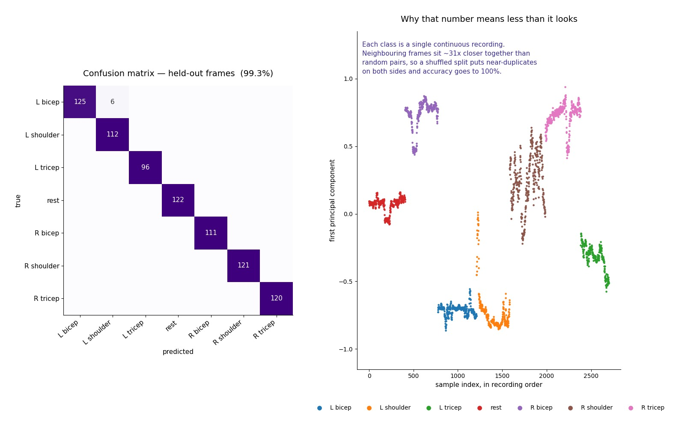

# Human activity recognition from pose landmarks

Seven-class classification of upper-body movements from pose-estimation landmarks,
and an analysis of why the first accuracy figure was not a measure of generalisation.

Machine Learning exam project, BSc in Artificial Intelligence — University of Pavia,
University of Milano-Bicocca, University of Milan.



*Left: confusion matrix on held-out frames. Right: the same data plotted in recording order.*

## Task

2,700 frames, each described by **132 features**: 33 body keypoints × (x, y, z,
visibility), the output format of a pose estimator such as MediaPipe Pose.

Seven classes, roughly balanced (317–435 samples each):

`left_bicep` · `right_bicep` · `left_tricep` · `right_tricep` ·
`left_shoulder` · `right_shoulder` · `rest`

## Method

A multilayer perceptron in Keras: dense layers with ReLU and He initialisation,
alternated with dropout, softmax output over seven classes.

Hyperparameters selected by **nested cross-validation** — 5-fold stratified outer
loop, 3-fold inner `GridSearchCV` — over 48 configurations of units (128, 256), depth
(1–3), learning rate (1e-3, 1e-4), dropout (0.1, 0.2) and batch size (32, 64).

The `StandardScaler` is fitted **inside each outer fold**, on the training split only.
Fitting it on the full dataset would let test-split statistics reach the model.

Stratified folds were used because the classes are slightly imbalanced.

LIME was applied to inspect which landmarks individual predictions rely on.

## Results

Nested cross-validation returns **100% accuracy**.

A perfect score on a seven-class problem warrants inspection of the data rather than
acceptance. Two properties emerged:

- the seven classes form **seven contiguous blocks** of roughly 386 samples each —
  one continuous recording per movement, not 2,700 independent observations
- consecutive frames are approximately **31× closer** to each other than randomly
  paired frames (median L2 distance 0.037 against 1.170)

A shuffled split therefore places near-duplicate frames on both sides of the
train/test boundary. The model is recognising frames it has effectively already seen.

Re-splitting **by time** — training on the first 70% of each recording, testing on the
last 30% — gives **99.3%**, with 6 errors out of 813, all `left_bicep` predicted as
`left_shoulder`. The model never confuses left with right.

That figure remains optimistic. With one recording session per class, train and test
come from the same session and the same subject. Estimating generalisation to a new
person would require recordings from multiple subjects and a subject-wise split.

## Limitations

Single-subject, single-session data. The evaluation cannot distinguish between a model
that has learned the movements and one that has memorised this particular recording.
Group-aware splitting is not possible here, since each class corresponds to exactly one
group.

## Repository

```
notebooks/pose_recognition.ipynb    preprocessing, nested cross-validation, LIME
leakage_check.py                    distance analysis, temporal split, figure
data/input_data.pkl                 landmarks and labels
figures/                            confusion matrix, temporal structure
```

`leakage_check.py` reproduces the analysis above: it measures the distance between
consecutive and random frames, counts the contiguous label blocks, and re-evaluates
the model under both splitting strategies.

## Note on methodology

Careful scaling inside cross-validation folds prevents one form of leakage. It does
nothing about this one. With temporally correlated data the unit of independence is
the recording, not the frame, and `StratifiedKFold` has no way of knowing that.
